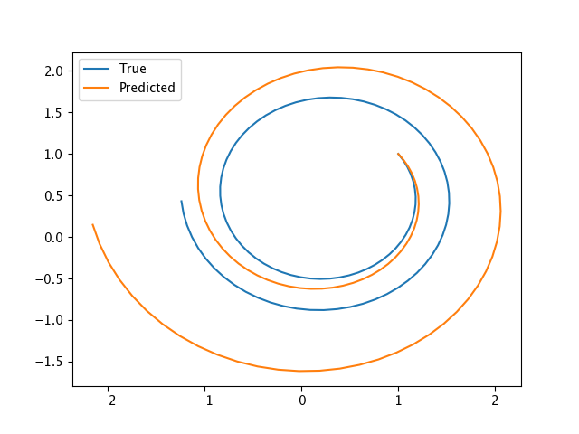

# Dynamics of Lorentz Equation using SINDy

### Least Square Method for Forced Linear Oscillator

Given the data of time series generated by set of a forced linear oscillator, 
```math
\dot{x} = -1.0 + 0.0x + 2.0y
```
```math
\dot{y} = 0.5 - 2.0x + 0.0y
```
the model generates the following equation as prediction from the time series data,
```math
\dot{x} = -1.02 + 0.1x + 1.99y
```
```math
\dot{y} = 0.45 - 1.99x + 0.1y
```
The difference in trajectories can be seen in the plot
